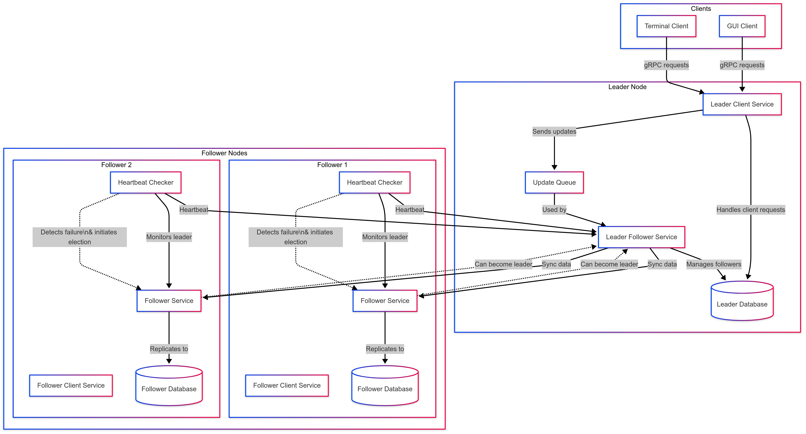
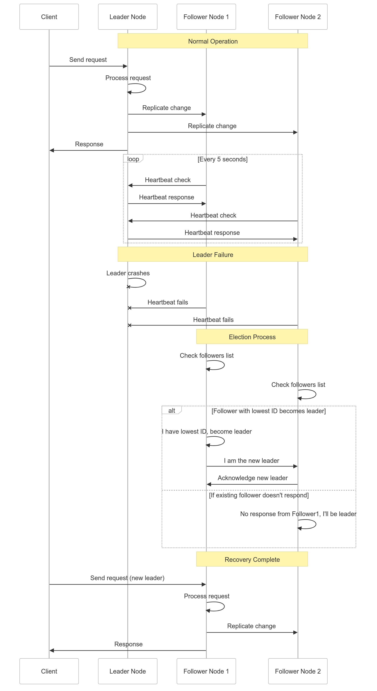
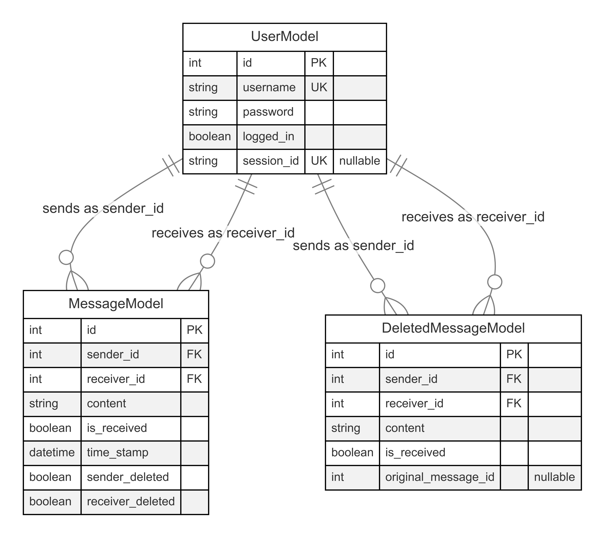

# Engineering Notebook

## Leader Follower Architecture Summary

We built this distributed chat application using a leader-follower model (as shown in Figure 1). In our system, the clients interact with a leader server that handles all writes, logins, and reads. Every write operation (e.g., user creation, message send, account deletion) is recorded in a persistent SQLite database, and the same update is serialized and sent to all followers using gRPC.

Followers start by requesting a full snapshot of the database via RegisterFollower, and then stay in sync by receiving updates through AcceptUpdates. These updates are distributed using a dedicated background thread on the leader.

Each follower runs a heartbeat checker to monitor the leader’s availability. If the leader fails, a new leader is elected among the followers based on a deterministic lowest-ID rule. The newly promoted leader picks up replication duties and continues accepting client requests. Clients are built in a way that they reconnect to the next available leader server.

  

**Figure 1 - Fault-Tolerant Chat System Architecture:** The client-server architecture where clients connect to the leader node, which manages the primary database and coordinates with follower nodes through replication. Follower nodes monitor the leader's "health" and stand ready to take over in case of failure, providing system resilience.

## Design Decisions

### 1. Separation of Leader and Follower Roles (Leader-Follower Replication)

We have a leader server that handles all of the client requests and database writes. The followers passively replicate the leader’s data via `AcceptUpdates`. When the leader experience crash/failstop failures, a follower with the lowest ID is elected as the new leader (process described in Figure 2).

  

**Figure 2 - Fault-Tolerant System Failover Process:** When a leader node fails, in normal operation, followers regularly send heartbeats to the leader. Upon leader failure, followers detect the outage through missed heartbeats, initiate an election based on node ID, establish a new leader, and resume client service with minimal disruption.

### 2. Persistence via SQLite & SQLAlchemy ORM

We assign each server (leader or follower) its own persistent SQLite database (e.g., chat_1.db, chat_2.db ...). There is no shared store which avoids a single point of failure. We have thre models: `UserModel`, `MessageModel`, and `DeletedMessageModel` (Figure 3). All models are managed using SQLAlchemy ORM. ORM objects are serialized and sent to followers.

  

**Figure 3 - Database Model:** The three main database tables are UserModel (storing user credentials and session data), MessageModel (containing active messages with sender/receiver relationships), and DeletedMessageModel (archiving removed messages). Foreign key relationships illustrate how users connect to their sent and received messages in both active and deleted states.

- PK stands for "Primary Key" - This is a column or set of columns that uniquely identifies each row in the table. In your schema, the id field is the primary key for each table. Primary keys cannot contain NULL values and must be unique across all rows.
- UK stands for "Unique Key" - This indicates a column or set of columns that must contain unique values across all rows, but unlike a primary key, it can accept NULL values (unless explicitly defined as NOT NULL). In your schema, username and session_id in the UserModel table are unique keys.

### 3. Follower Initialization & Data Sync
When a new follower server starts, it must first synchronize its local state with the current leader to become a fully consistent replica of the leader. On receiving the request, the leader responds with a full database dump to sync state (initial replication). Followers deserialize the chat data in into own local SQL database. It also stores the current list of active followers for participation in future leader elections and replication.

### 4. Replication: Push-based Update Propagation
We use a push-based replication model to maintain consistency across all replicas.  Any state-changing operation (e.g. user creation, message sending, or account deletion) is placed into an update queue. A dedicated background thread monitors this queue and ensures that changes are immediately propagated to all followers. The leader then distributes these serialized updates to each follower via gRPC calls. Our design ensures that all followers are consistently updated in near real-time without data loss.

### 5. Session-Scoped Connections for Thread-Safety
We use `scoped_session` to ensure thread-safe database interactions for multi-threaded gRPC servers. Without proper session isolation, concurrent threads could interfere with each other’s database operations, leading to data corruption, stale reads, or transaction conflicts. By wrapping the session factory in `scoped_session`, each thread automatically gets its own dedicated database session, avoiding cross-thread interference.

### 6. Client Awareness & Failover Handling
We have designed the client so that it mains maintain a list of known server addresses so that they have awareness of multiple server addresses. This list is used to ensure continued service availability in the event of a leader crash. When a client initiates a connection, it attempts to communicate with the first server in its list (assumed to be the leader). If the leader is unreachable, the client rotates to the next server in its list and attempts reconnection. The client continues rotating until it reaches either a new leader that has been elected among the followers, or a previously unreachable but now-available original leader.

-----------------------------------

## Day to Day Progress

#### Mar 14, 2025

We primarily focused on troubleshooting our design exercise and encountered issues getting the JSON-based server and client implementation to run smoothly across different environments. We decided to avoid implementing Raft for election and instead opted for a simplified minimum process ID–based election mechanism. A lot of our time was spent debugging networking configurations, particularly differences between Windows and Ubuntu systems.

##### Work Completed

- Troubleshooting JSON Server/Client
    - Found that the server/client only worked when run from within their respective directories.
    - Used `ipconfig` on Windows to retrieve local IP; updated `chat_config` accordingly.
    - Noted incompatibility between IPs from Windows and Ubuntu environments.
- Design Decisions
    - Considered but did not proceed with using the gRPC implementation at this stage.
    - Attempted to use JSON-based system for replication and persistence.

#### Mar 15, 2025

We explored using our custom protocol instead of JSON for replication and persistence, as the JSON setup proved too complex. We also tried incorporating Raft-style leader election but faced issues due to servers being out of sync on election terms. This caused multiple leaders to be elected independently. We ultimately decided to move away from Raft toward a simpler approach.

##### Work Completed

- Protocol Simplification
    - Switched from JSON to custom protocol for lower overhead and easier integration.
- Raft Experimentation
    - Attempted to use Raft but encountered term desynchronization between servers.
    - Observed issues with multiple leaders being elected simultaneously.
    - Decided to abandon Raft and adopt a simpler static election mechanism.

#### Mar 21, 2025

We decided to switch back to using gRPC after resolving earlier issues with protobuf installation and versioning conflicts. The primary fix involved downgrading Python to 3.11.5 and regenerating the environment. We also reworked our design to adopt a leader-follower architecture based on minimum process ID, and implemented persistent storage using SQLite.

##### Work Completed

- Environment Setup
    - Downgraded Python to 3.11.5 to match compatible gRPC/protobuf versions.
    - Created a working `requirements.txt` for consistent dependency management.
- Leader Election
    - Adopted a leader-follower (master-slave) model with election via minimum PID.
- Persistence
    - Implemented SQLite-based storage to persist messages across restarts.

#### Mar 22, 2025

We refined the leader-follower architecture and replaced raw SQLite calls with SQLAlchemy ORM to improve modularity and maintainability. The database schema now includes three main models: `USER`, `MESSAGE`, and `DELETE_MESSAGE`.

##### Work Completed

- Architecture Finalization
    - Debugged failover behavior and finalized leader election logic.
- SQLAlchemy Integration
    - Replaced direct SQLite usage with ORM-based schema using SQLAlchemy.
    - Defined structured models for users, messages, and deleted messages.
- Debugging
    - Continued testing and fixing issues across server and database layers.

#### Mar 23, 2025

We made several enhancements to the GUI and updated our `.proto` definitions to better support the delete message functionality. There were also issues ensuring that all replicated servers applied database changes consistently, which we spent time debugging and resolving.

##### Work Completed

- GUI Updates
    - Improved user interaction and message deletion interface.
- Protocol & Replication Fixes
    - Modified `.proto` files to support new functionality.
    - Fixed database sync issues across replicated servers.

#### Mar 24, 2025

We fixed the login session behavior after leader failover. Originally, clients had to log in again after reconnecting to the new leader, but we updated the system to preserve session information and ensure seamless failover. We also identified port reuse issues on Windows that caused problems when restarting promoted leaders.

##### Work Completed

- Seamless Session Handling
    - Preserved session info across leader transitions without requiring re-login.
    - Confirmed correct behavior via testing and discussion with course staff.
- Cross-Platform Testing
    - Verified that the system works fully on a single Ubuntu/WSL machine.
    - Found that Windows has trouble re-binding ports after leader crash (due to TIME_WAIT).
    - Attempted multiple cleanup strategies including `.stop()`, `gc.collect()`, and manual delays.
- Code Quality Improvements
    - Added docstrings throughout the codebase.
    - Created test scripts to validate key system components. We achieved ~85% test coverage.

More details on the code structure and how to run the code can be found in the [`README.md`](https://github.com/sukikrishna/Fault_Tolerant_Chat_App/tree/main)
